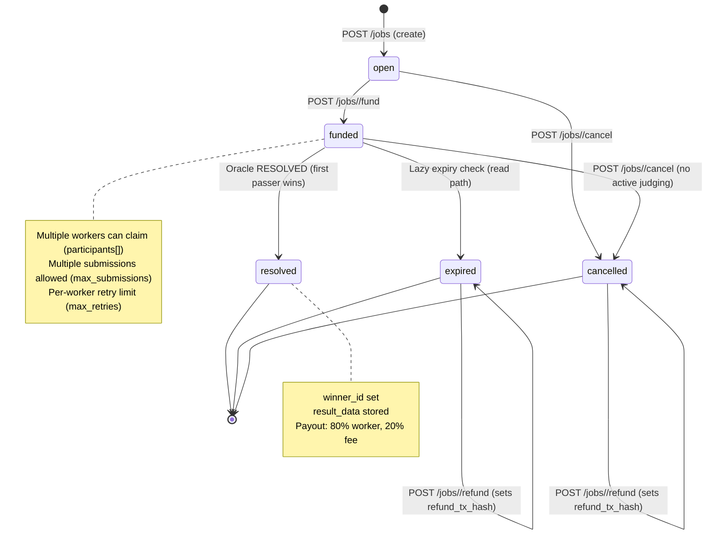
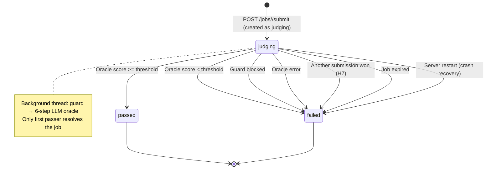

# Existing State Machine — synai-relay

> Auto-generated by Phase 1.4 capability survey
> Source: `server.py`, `models.py`, `services/job_service.py`

## Job Status Enum

Defined as string constants (not a Python Enum). Source: `models.py:46` comment + `server.py:6` docstring.

| Status | Description | Terminal? |
|---|---|---|
| `open` | Job created, awaiting funding | No |
| `funded` | USDC deposit verified, accepting workers/submissions | No |
| `resolved` | Oracle accepted a submission, winner determined | Yes |
| `expired` | Past deadline without resolution | Semi (can refund) |
| `cancelled` | Buyer cancelled before resolution | Semi (can refund) |

**Note**: There is no explicit `claimed`, `submitted`, `accepted`, `settled`, or `refunded` status. These concepts exist implicitly:
- **Claimed**: `worker_id in job.participants[]` (JSON array)
- **Submitted/Judging**: `Submission.status = 'judging'`
- **Accepted**: `Submission.status = 'passed'` + `Job.status = 'resolved'` (atomic)
- **Refunded**: `Job.refund_tx_hash is not None` (on a cancelled/expired job)

## Submission Status Enum

Defined as string constants. Source: `models.py:84` comment + `server.py:6` docstring.

| Status | Description | Terminal? |
|---|---|---|
| `pending` | Created but not yet processed | No |
| `judging` | Oracle evaluation in progress (background thread) | No |
| `passed` | Oracle accepted the submission | Yes |
| `failed` | Oracle rejected, guard blocked, error, or cancelled | Yes |

**Note**: In practice, submissions are created directly as `judging` (never `pending`), because the oracle thread starts immediately upon submission.

## State Transitions

### Job State Transitions

```
open ──────────────→ funded         (POST /jobs/<id>/fund, buyer deposits USDC)
open ──────────────→ cancelled      (POST /jobs/<id>/cancel, buyer cancels)
funded ────────────→ resolved       (Oracle verdict: RESOLVED, atomic first-passer wins)
funded ────────────→ expired        (Lazy check: job.expiry < now, on list/get)
funded ────────────→ cancelled      (POST /jobs/<id>/cancel, buyer cancels — blocks if judging active)
expired ───────────→ [refunded]     (POST /jobs/<id>/refund, sets refund_tx_hash)
cancelled ─────────→ [refunded]     (POST /jobs/<id>/refund, sets refund_tx_hash)
```

### Submission State Transitions

```
[created as judging] → passed       (Oracle score >= threshold, job not yet resolved)
[created as judging] → failed       (Oracle score < threshold)
[created as judging] → failed       (Guard blocked)
[created as judging] → failed       (Oracle error/exception)
[created as judging] → failed       (Another submission won → all others discarded)
[created as judging] → failed       (Job cancelled while judging — NOT allowed per C2)
[created as judging] → failed       (Job expired during judging)
[created as judging] → failed       (Server restarted during judging — crash recovery)
```

## Transition Rules (Detailed)

### T1: open → funded
- **Trigger**: `POST /jobs/<task_id>/fund`
- **Caller**: buyer_id must match job.buyer_id
- **Conditions**: Job status == `open`, valid `tx_hash`, on-chain verification passes (or DEV_MODE)
- **Side effects**: Sets `deposit_tx_hash`, `depositor_address`
- **Guards**: `deposit_tx_hash` UNIQUE constraint prevents double-funding

### T2: open → cancelled
- **Trigger**: `POST /jobs/<task_id>/cancel`
- **Caller**: buyer_id must match job.buyer_id
- **Conditions**: Job status == `open`
- **Side effects**: None (no funds to handle)

### T3: funded → resolved
- **Trigger**: Oracle background thread in `_run_oracle()`
- **Caller**: Internal (background thread)
- **Conditions**:
  - Submission oracle score >= `ORACLE_PASS_THRESHOLD` (default 80)
  - Job still in `funded` state (atomic check via `Job.query.filter_by(status='funded').update(...)`)
- **Side effects**:
  - `Job.winner_id` = worker_id
  - `Job.result_data` = submission content
  - All other pending/judging submissions → `failed`
  - Payout: 80% → worker, 20% → fee wallet
  - Worker reputation updated
- **Atomicity**: Only first passer wins (row-level update filter on `status='funded'`)

### T4: funded → expired
- **Trigger**: Lazy check on `GET /jobs` or `GET /jobs/<task_id>`
- **Caller**: Any reader (passive expiry)
- **Conditions**: `job.expiry` is set AND `now >= job.expiry`
- **Side effects**: All pending/judging submissions → `failed`
- **Implementation**: `JobService.check_expiry()` — runs on every job read

### T5: funded → cancelled
- **Trigger**: `POST /jobs/<task_id>/cancel`
- **Caller**: buyer_id must match job.buyer_id
- **Conditions**:
  - Job status == `funded`
  - No submissions currently `judging` (409 if any active)
- **Side effects**: All pending/judging submissions → `failed`
- **Concurrency**: `with_for_update()` row lock, re-check under lock (C2)

### T6: expired → [refunded]
- **Trigger**: `POST /jobs/<task_id>/refund`
- **Caller**: buyer_id must match job.buyer_id
- **Conditions**: Job status == `expired`, `refund_tx_hash` is None
- **Side effects**:
  - On-chain: `WalletService.refund()` sends full amount to depositor
  - Off-chain: `refund_tx_hash = 'off-chain'`
- **Idempotency**: `refund_tx_hash = 'pending'` marker prevents concurrent double-refund (C1)
- **Note**: Job status does NOT change — it stays `expired` with `refund_tx_hash` set

### T7: cancelled → [refunded]
- Same as T6 but from `cancelled` state (only relevant if job was funded before cancel)

## State Diagram (Mermaid)



## Submission State Diagram (Mermaid)



## Invariants and Business Rules

1. **Only buyer can fund/cancel/refund** their own jobs
2. **Worker must register** (`POST /agents`) before claiming
3. **Worker cannot self-deal** (worker_id != buyer_id)
4. **Multi-worker**: Multiple workers can claim the same funded job
5. **First-passer wins**: When oracle accepts a submission, atomic update resolves the job; all other submissions discarded
6. **Max submissions per task**: Default 20 (configurable)
7. **Max retries per worker**: Default 3 (configurable)
8. **Content size limit**: 50KB per submission (C3)
9. **Cancel blocks on judging**: Cannot cancel funded job while submissions are being judged (409)
10. **Lazy expiry**: Jobs expire on read, not proactively (no scheduler)
11. **Refund is not a state**: Refund sets `refund_tx_hash` but does not change job status
12. **Crash recovery**: Stuck `judging` submissions reset to `failed` on server startup (L11)
13. **Reputation**: `completion_rate` = passed_submissions / total_claims, updated after each verdict
14. **Min reputation gate**: Jobs can require minimum `completion_rate` for workers to claim
